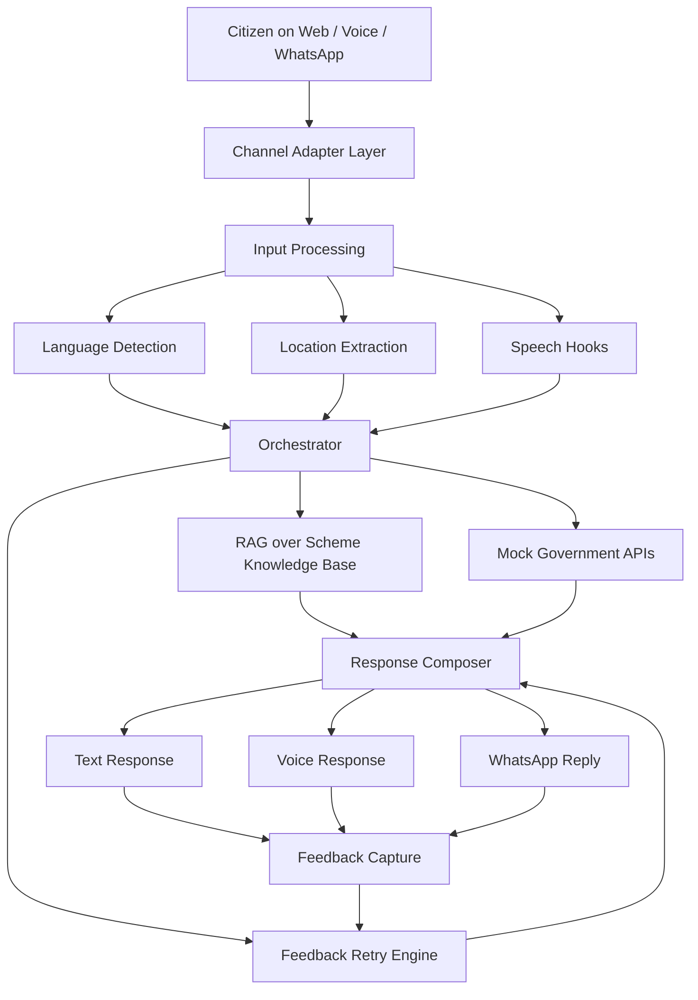

# JanSahayak Architecture

## 1. High-level architecture

## 2. Modules

### Channel layer
- Web chat UI
- WhatsApp-style mock UI
- Voice hooks for STT/TTS

### Input processing
- Detect language from incoming text or audio transcripts
- Resolve location from pincode, district, or state
- Normalize user intent into a common request shape

### Orchestrator
- Chooses the response strategy
- Calls the knowledge base search
- Calls mock transactional APIs
- Produces a combined answer

### Knowledge layer
- Local JSON knowledge store for scheme summaries
- Search logic weighted by query match and state/district relevance

### Integration layer
- Mock Eligibility API
- Mock Application Status API
- Mock Grievance Routing API
- Future: real government APIs

### Feedback layer
- Captures positive/negative feedback
- Rewrites the answer in simpler and more location-specific terms
- Future: persistent analytics and ranking optimization

## 3. Why this architecture works for the hackathon
- It demonstrates multilingual, multi-channel, and location-aware behavior
- It supports a clear feedback-to-improvement loop
- It is modular enough to scale later
- It keeps sensitive production dependencies out of the initial scope

## 4. Future production extensions
- Real Sarvam SDK integration for chat, STT, TTS, and translation
- Persistent vector store and document ingestion pipeline
- WhatsApp Business API webhook deployment
- Notification service for new schemes by location
- Consent-based secure identity integration
